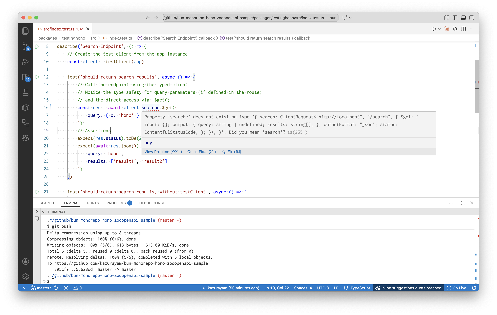

== Helpers / Testing

元ネタ: https://hono.dev/docs/guides/testing[Hono / Guides / Testing]

元ネタの冒頭にこう書いてある。

[quote]
____
The testClient() function takes an instance of Hono as its first argument and returns an object typed according to your Hono application's routes, similar to the https://hono.dev/docs/guides/rpc#client[Hono Client].
____

この文が何を意味しているか、よくわからない。研究してみよう。

[source,typescript]
----
    const client = testClient(app)

    test('should return search results', async () => {
        const res = await client.search.$get({
            query: { q: 'hono' }
        });
----

こんなふうに `testClient`` のインスタンスである `client` は `search` プロパティを持っている。`search` プロパティの `$get` メソッドを呼び出すことができる。この短いコードで  `index.ts` の中で定義されたHonoオブジェクトに定義された route の一つ、すなわち

[source,typescript]
----
const app = new Hono()
    .get('/search', (c) => {
        const query = c.req.query('q')
        return c.json({query: query, results: ['result1', 'result2']})
    })
----

を呼び出すことができる。それはわかった。では、上記のテストと同じことをするtestを `testClient` を使わずに書いてみよう。どんなコードになるか？duckduckgoのSearch assist AIに質問してみた。

[quote]
____
how to test Hono without testClient
____

そしたらこんな応答があった。

[quote]
____
You can test Hono applications by creating a Request and passing it to the Hono application to validate the Response. Use the app.request method to simulate requests and check the responses directly in your tests.
____

=== Testing Hono Applications Without testClient
==== Basic Testing Setup

You can test Hono applications without using the testClient by directly creating requests and validating responses. Here’s how to do it:

- Create a Request: Use the Request class to simulate HTTP requests.
- Pass the Request to the Hono App: Call the app's request handler with the created request.
- Validate the Response: Check the response status and body.

==== Example Code

Here’s a simple example of how to test a Hono application without testClient:

[source,typescript]
----
import { Hono } from 'hono';
import { describe, test, expect } from 'vitest';

const app = new Hono();

app.get('/posts', (c) => {
  return c.json({ message: 'Many posts' }, 200);
});

describe('GET /posts', () => {
  test('should return posts', async () => {
    const req = new Request('http://localhost/posts', { method: 'GET' });
    const res = await app.request(req);

    expect(res.status).toBe(200);
    expect(await res.json()).toEqual({ message: 'Many posts' });
  });
});
----

==== Testing POST Requests

For testing POST requests, you can include a body in your request:

[source,typescript]
----
app.post('/posts', (c) => {
  return c.json({ message: 'Created' }, 201);
});

describe('POST /posts', () => {
  test('should create a post', async () => {
    const req = new Request('http://localhost/posts', {
      method: 'POST',
      body: JSON.stringify({ message: 'hello' }),
      headers: { 'Content-Type': 'application/json' },
    });
    const res = await app.request(req);

    expect(res.status).toBe(201);
    expect(await res.json()).toEqual({ message: 'Created' });
  });
});
----

==== Conclusion

By creating requests manually and passing them to your Hono application, you can effectively test your endpoints without relying on testClient. This method allows for flexibility in testing various HTTP methods and scenarios.

ふむふむ、参考になった。ではコードを自作してみよう。まずサーバのコードがこれ。

{BRANCH_URL}/packages/testclient/src/index.ts[testclient/src/index.ts]
[source,typescript]
----
include::../packages/testclient/src/index.ts[]
----

そしてサーバをテストするコードがこれ。このコードは二つのtestを実装している。

{BRANCH_URL}/packages/testclient/src/index.ts[testclient/src/index.test.ts]
[source,typescript]
----
include::../packages/testclient/src/index.test.ts[]
----

二つのtestは同じことをする。ただし前者はtestClientを使っているが後者はtestClientを使わずにやっている。appがrouteに型を明示的に宣言していればtestClientを使ったコードを書くときTypeScript言語の型検査が動く。だからたとえば私がエディタで

[source,typescript]
----
    ... = await client.searche.$get({
----

と書いたとしたら、searcheが間違いで、正しくはsearchと書くべきだ、とVSCodeのエディタが教えてくれるだろう。こんなふうに:

いっぽう、testClientを使わない後者のコードではどうか？

[source,typescript]
----
    ... = new Request('http://localhost/searche?q=hono', { method: 'GET' })
----

のようにstringリテラルの中でsearchをsearcheと書いたらどうか？ ... エディタはわたしがやらかした間違いを指摘することができない。

このように `testClient` はTypeScript言語の型検査の力をオーサリング時に享受できるようにしてくれる。testClientを使わなければ型検査の力を享受できない。この違いは大きい。だから testClient を活用するべきだ。
